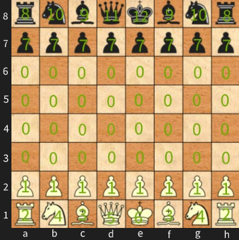

#### Team SIGSEGV @ PA 2022-2023
##### __[Bacaran Oana Maria](https://github.com/OanaMB)__   __[Mihoreanu Cosmina](https://github.com/cos-mih)__   __[Toader Ana-Maria](https://github.com/anatoad)__

#### :bulb: About
Bot written in C++ that can play the Crazy House variant of chess, using the Minimax algorithm to determine the optimal move.

#### Compiling instructions
`make clean` 
`make`

#### To run the program
`xboard -fcp "make run"`  
`xboard -fcp "make run" -debug` *(run in debug mode)*

#### Project Structure
The internal representation of the chessboard is an 8x8 bidimensional array, in which every piece is encoded as a positive integer:

The source files provide a minimal interface to the XBoard program.

#### :page_facing_up: Main.cpp
Creates a new Bot instance for each new game, parses the commands received from XBoard, and takes the next move calculated by the bot. Records each move generated by XBoard in the internal representation of the chessboard (`Bot::recordMove()`), and then calculates the next move (`Bot::calculateNextMove()`).

#### :page_facing_up: Move.cpp, Move.h, Piece.h, PlaySide.h
Provide functionalities for identifying different types of moves, chess pieces, and player types.  

#### :page_facing_up: Bot.cpp, Bot.h
Contain the actual implementation of the engine that can interface with XBoard. It includes functionalities for recording moves, calculating next moves, move generation, legality checks, special moves like castling and en passant, and evaluating board positions. The Minimax algorithm is used for move generation, and a simple heuristic evaluation function is employed for scoring. The game engine also handles stalemates and checkmate conditions and provides functions for generating all possible moves for a player's configuration of the chessboard. Additionally, it has functions for defending against check, generating all possible moves for a player, checking for checkmate, and determining if a player is in check. The algorithm implementation employs a depth limit to manage the large solution space and reduce computational complexity.  

#### Castling
When the bot calculates the next move, it checks if it's possible to perform a castle move. The `Bot::castle()` function is used to verify that all the conditions for executing the move *[3]* are met:
- [x] The king has not been moved.
- [x] The rook has not been moved.
- [x] The king is not in check.
- [x] The king does not pass through check (if any intermediate square that the king passes through would put it in check, the castling move cannot be performed).
- [x] There are no pieces between the king and the rook.

#### Draw by repetition
If the number of consecutive moves without captures or pawn moves reaches 50, a draw is declared by sending the message *'1/2-1/2 {Draw by repetition}'* to XBoard, according to the *Fifty-move rule [5]*.

#### Minimax
The next move in the game is calculated using the Minimax algorithm. The temporal complexity of this algorithm is O(b^4), where b is the number of branches at each level, and the spatial complexity is O(b). The engine aims to maximize its points, while the opponent tries to minimize the engine's gains. The evaluation of a chessboard configuration is done using the `Bot::evaluate()` function, which employs a simplistic heuristic evaluation based on the difference in points between the engine's and the opponent's pieces. The solution space, which is tree-like, is too vast to be fully explored within the allocated game time. Therefore, the exploration is limited to a maximum depth of 4, with two moves each for the engine and the opponent. The algorithm stops exploring a branch if either player is in check. The next move is selected based on the highest score at depth 0.  

#### :bookmark: References
> [1] https://www.gnu.org/software/xboard/engine-intf.html  
> [2] https://www.chess.com/terms/chess-piece-value  
> [3] https://www.chess.com/terms/castling-chess  
> [4] https://ocw.cs.pub.ro/courses/pa/laboratoare/laborator-05  
> [5] https://en.wikipedia.org/wiki/Fifty-move_rule  
